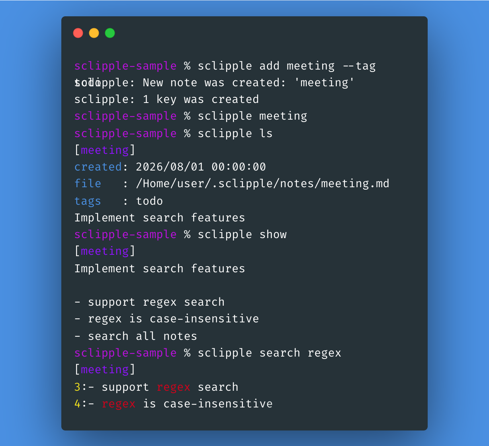

# sclipple

A small command-line note manager based on keyword-addressed notes.

When working in a terminal, you often want to write something down quickly without creating files in the current directory.

sclipple stores notes in a dedicated location and lets you access them from anywhere using short keywords. Notes can also be grouped and selected using tags.

```sh
$ sclipple add todo --tag work
$ sclipple todo
```

The note can later be opened from any directory.

---

## Features

- Keyword-based note management
- Tagging and tag-based note selection
- Notes accessible from any directory
- Editor-independent
- Plain text storage
- Fast full-text search using POSIX extended regular expressions
- Git integration for version control

---

## Example

A typical workflow:

1. Create a note with a short key, optionally assigning one or more tags.
2. Edit it using your favorite editor.
3. List, show, or search notes by key or tag.
4. Add or remove tags as the note collection grows.
5. Use Git integration if version control is desired.



---

## Installation

```sh
$ ./configure
$ make
$ make install
```

---

## Quick Start

Create a note:

```sh
$ sclipple add todo
```

Command-line options can temporarily override configuration values. For example:

```sh
$ sclipple --directory /tmp/notes add scratch
$ sclipple add draft --extension md
$ sclipple --editor "nvim -p" draft
$ sclipple ls -t work -t urgent --tag-match and
```

Create a note with tags:

```sh
$ sclipple add todo --tag work --tag urgent
```

Edit the note:

```sh
$ sclipple todo
```

Show the note:

```sh
$ sclipple show todo
```

List all notes:

```sh
$ sclipple ls
```

List notes having a tag:

```sh
$ sclipple ls --tag work
```

Search notes:

```sh
$ sclipple search deadline
```

Add another tag to an existing note:

```sh
$ sclipple tag todo --tag project
```

Remove a tag:

```sh
$ sclipple untag todo --tag urgent
```

Rename a note:

```sh
$ sclipple mv todo tasks
```

Remove a note:

```sh
$ sclipple rm tasks
```

---

## Concepts

### Keys

Each note is identified by a unique **KEY**.

```sh
$ sclipple add project
```

creates a note associated with the key:

```text
project
```

The key can later be used to edit, display, search, rename, remove, tag, or untag the note.

KEYs follow these rules:

- A KEY may contain ASCII letters, digits, `_`, and `-`.
- `.` and `..` are not valid KEY values.
- A KEY used to create or rename a note must not already exist.

### Tags

A note may have zero or more **TAG** values.

Tags can be assigned when a note is created:

```sh
$ sclipple add project --tag work --tag active
```

or added later:

```sh
$ sclipple tag project --tag important
```

The short option `-t` is equivalent to `--tag`:

```sh
$ sclipple ls -t work
```

Repeat `-t` or `--tag` to specify multiple tags.

TAGs follow these rules:

- A TAG may contain letters, digits, `_`, `-`, and `.`.
- A TAG must not begin with `-`.
- Duplicate tag arguments are ignored where applicable.

Adding a tag that a note already has leaves that tag unchanged. Removing a tag that a note does not have leaves the note unchanged.

### Selecting notes by key and tag

The `rm`, `ls`, `search`, and `show` commands can select notes by KEY, TAG, or both. Editing supports the same selection rules and may be invoked with KEYs, TAGs, or both.

When multiple TAG selectors are given, `tag-match` controls how they are combined:

- `or` selects a note if it has at least one requested TAG. This is the default.
- `and` selects a note only if it has every requested TAG.

The `tag-match` setting affects only the TAG selection. When KEY and TAG selection are used together, the result is the **union** of the KEY selection and the resulting TAG selection. A note matched more than once is processed only once.

For example, with the default `tag-match = or`:

```sh
$ sclipple ls project --tag work --tag urgent
```

selects the note named `project`, every note tagged `work`, and every note tagged `urgent`. With:

```sh
$ sclipple ls project --tag work --tag urgent --tag-match and
```

the note named `project` is selected regardless of its tags, while other notes are selected only if they have both `work` and `urgent`.

---

## Commands

### Create notes

```sh
$ sclipple add <KEY> [<KEY> ...] [--tag <TAG>]... [--directory <DIR>] [--extension <EXT>]
```

Create one or more notes. Each KEY becomes a new note keyword.

Use `-t TAG` or `--tag TAG` to assign tags at creation time. Repeat the option to assign multiple tags.

Use `--directory DIR` to use a different storage directory for the command, and `--extension EXT` to override the extension used for the newly created note files. `DIR` must be an absolute path.

Examples:

```sh
$ sclipple add todo
$ sclipple add todo ideas
$ sclipple add todo --tag work
$ sclipple add todo ideas -t work -t active
$ sclipple add todo --extension md
$ sclipple --directory /tmp/notes add scratch
```

If the storage directory or list file does not yet exist, `add` initializes them automatically.

---

### Edit notes

```sh
$ sclipple [<KEY> ...] [--tag <TAG>]... [--tag-match <MODE>] [--directory <DIR>] [--editor <COMMAND>]
```

Open selected notes in the configured editor.

Any non-option argument that is not a built-in command is treated as a note KEY. Multiple KEY arguments can be specified. TAG selectors may be used with KEYs or by themselves.

Use `--tag-match MODE` to override how multiple TAG selectors are combined for this invocation. `MODE` must be `and` or `or`. The default is `or`.

Use `--directory DIR` to select a different storage directory and `--editor COMMAND` to override the configured editor for the command. `DIR` must be an absolute path.

Examples:

```sh
$ sclipple project
$ sclipple project todo
$ sclipple project --tag work
$ sclipple project -t work -t urgent
$ sclipple -t work -t urgent --tag-match and
$ sclipple --editor "nvim -p" project
```

---

### List notes

```sh
$ sclipple ls [<KEY> ...] [--tag <TAG>]... [--tag-match <MODE>] [--directory <DIR>]
```

List notes. Without KEY or TAG arguments, all notes are listed.

For each note, the output includes:

- KEY
- creation timestamp
- note file path
- tags
- first non-empty line

Long first lines are shortened.

Examples:

```sh
$ sclipple ls
$ sclipple ls project todo
$ sclipple ls --tag work
$ sclipple ls project -t work -t urgent
$ sclipple ls -t work -t urgent --tag-match and
```

---

### Show notes

```sh
$ sclipple show [<KEY> ...] [--tag <TAG>]... [--tag-match <MODE>] [--directory <DIR>]
```

Print full note contents to stdout. Without KEY or TAG arguments, all notes are shown.

Each note begins with a `[KEY]` header. When stdout is a terminal, the header is colorized.

Examples:

```sh
$ sclipple show
$ sclipple show project
$ sclipple show --tag work
$ sclipple show project -t work -t urgent
$ sclipple show -t work -t urgent --tag-match and
```

---

### Search notes

```sh
$ sclipple search <PATTERN> [<KEY> ...] [--tag <TAG>]... [--tag-match <MODE>] [--directory <DIR>]
```

Search note contents using a POSIX extended regular expression. The search is case-insensitive.

Without KEY or TAG arguments, all notes are searched. KEY and TAG arguments can be used to select notes before searching.

Matching notes are printed with their keyword, and matching lines are printed with line numbers. When stdout is a terminal, keywords, line numbers, and matches are colorized.

Examples:

```sh
$ sclipple search deadline
$ sclipple search 'todo|urgent'
$ sclipple search 'error.*log' project
$ sclipple search deadline --tag work
$ sclipple search deadline project -t work
$ sclipple search deadline -t work -t urgent --tag-match and
```

---

### Add tags

```sh
$ sclipple tag <KEY> [<KEY> ...] --tag <TAG> [--tag <TAG>]... [--directory <DIR>]
```

Add one or more tags to one or more existing notes.

Duplicate KEY and TAG arguments are ignored. Adding a tag that a note already has leaves that tag unchanged.

If some specified KEY values do not exist, an error is reported for those keys while the existing notes are still processed.

Examples:

```sh
$ sclipple tag project --tag work
$ sclipple tag project todo -t work -t active
```

---

### Remove tags

```sh
$ sclipple untag <KEY> [<KEY> ...] --tag <TAG> [--tag <TAG>]... [--directory <DIR>]
```

Remove one or more tags from one or more existing notes.

Duplicate KEY and TAG arguments are ignored. Removing a tag that a note does not have leaves that note unchanged.

If some specified KEY values do not exist, an error is reported for those keys while the existing notes are still processed.

Examples:

```sh
$ sclipple untag project --tag work
$ sclipple untag project todo -t work -t active
```

---

### Rename notes

```sh
$ sclipple mv <OLD_KEY> <NEW_KEY> [--directory <DIR>]
```

Rename a note keyword. The note index is updated and the note file is renamed so that its filename begins with the new KEY.

`NEW_KEY` must follow the same validation rules as a KEY passed to `add`, and it must not already exist.

Example:

```sh
$ sclipple mv todo tasks
```

---

### Remove notes

```sh
$ sclipple rm [<KEY> ...] [--tag <TAG>]... [--tag-match <MODE>] [--directory <DIR>]
```

Remove notes selected by KEY or tag. The note file and its corresponding index entry are removed.

Examples:

```sh
$ sclipple rm tasks
$ sclipple rm project todo
$ sclipple rm --tag obsolete
$ sclipple rm project -t obsolete -t temporary
$ sclipple rm -t obsolete -t temporary --tag-match and
```

---

### Git integration

```sh
$ sclipple [--directory <DIR>] git <GIT_ARGUMENTS>...
```

Run Git inside the configured sclipple data directory. Arguments are passed directly to Git, so ordinary Git subcommands can be used.

Use `--directory DIR` before `git` to override the storage directory. Because arguments after `git` are passed directly to Git, the option must appear before `git`. `DIR` must be an absolute path.

Git arguments are not interpreted as sclipple KEYs.

Examples:

```sh
$ sclipple git status
$ sclipple git init
$ sclipple git add .
$ sclipple git commit -m "update notes"
$ sclipple --directory /path/to/notes git log --oneline
```

This makes it easy to keep notes under version control.

---

## Help

Show the complete help:

```sh
$ sclipple --help
```

Show help for a specific built-in command:

```sh
$ sclipple add --help
$ sclipple ls --help
$ sclipple tag --help
$ sclipple untag --help
```

---

## Configuration

sclipple reads:

```text
~/.sclipplerc
```

Example:

```ini
editor = vim -p
extension = txt
directory = ~/.sclipple
tag-match = or
```

### Supported settings

| Setting | Description | Default |
|---|---|---|
| `editor` | Editor command used when opening notes | `vim -p` |
| `extension` | Extension used for newly created notes | `txt` |
| `directory` | Directory used to store sclipple data | `~/.sclipple` |
| `tag-match` | How multiple TAG selectors are combined: `and` or `or` | `or` |

The storage location can be changed using the `directory` setting. The value must resolve to an absolute path and may contain environment variables or `~`.

Notes:

- Lines beginning with `#` are treated as comments.
- Surrounding single or double quotes around values are removed.

Another example:

```ini
editor = 'nvim -p'
extension = md
directory = ~/notes
tag-match = and
```

### Command-line overrides

The configuration settings can be overridden for a single invocation with command-line options:

| Option | Description |
|---|---|
| `--directory DIR` | Override the storage directory. `DIR` must be an absolute path. |
| `--extension EXT` | Override the extension used for newly created notes. |
| `--editor COMMAND` | Override the editor command used to open notes. |
| `--tag-match MODE` | Override how multiple TAG selectors are combined. `MODE` must be `and` or `or`. |

Command-line values take precedence over values read from `~/.sclipplerc`. Settings that are not overridden continue to use the value from the configuration file, or the built-in default if the setting is absent.

Examples:

```sh
$ sclipple --directory /tmp/notes ls
$ sclipple add draft --extension md
$ sclipple --editor "nvim -p" draft
$ sclipple ls -t work -t urgent --tag-match and
```

`--extension` affects newly created notes and is therefore used with `add`. `--editor` affects opening notes for editing. `--tag-match` affects commands that select existing notes by TAG (`rm`, `ls`, `search`, `show`, and editing). `--directory` can be used with storage-dependent operations. When using `git`, place `--directory` before `git` because all following arguments are passed directly to Git.


